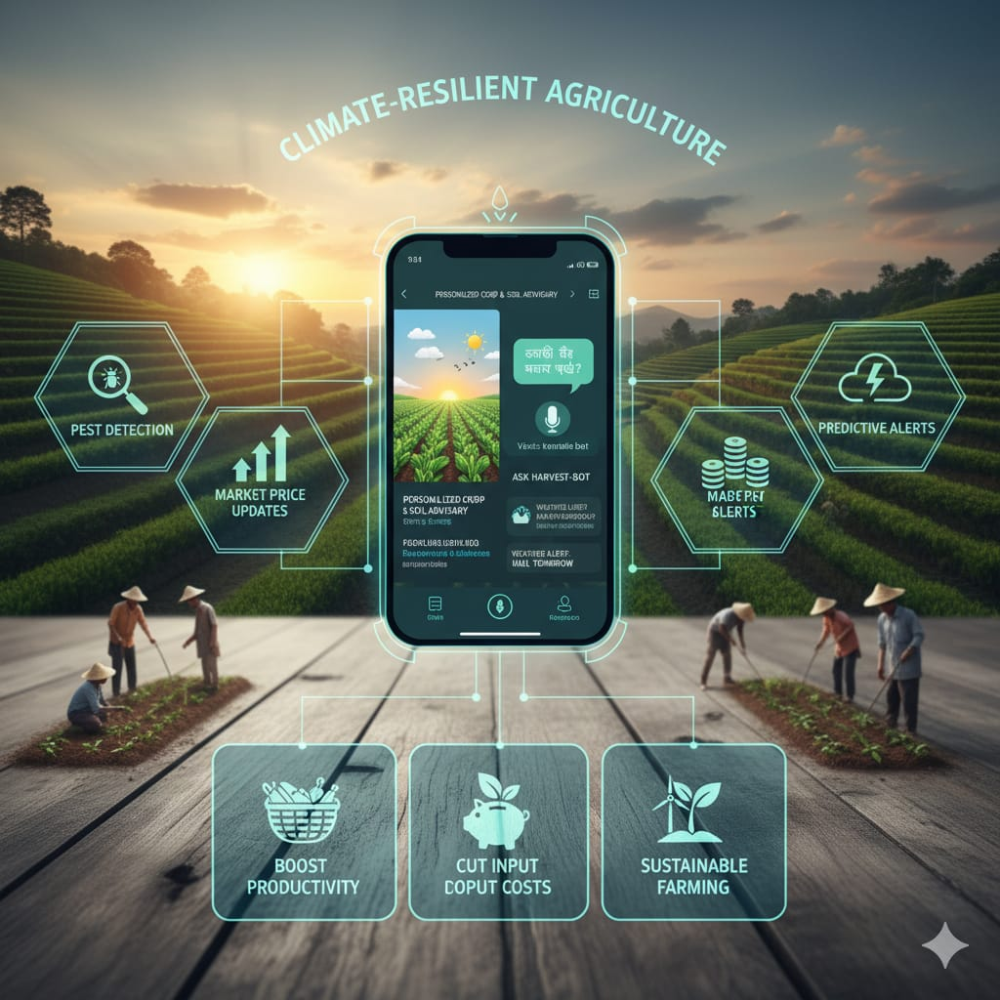

# Smart India Hackathon Workshop
# Date:27.09.2025
## Register Number:25012671
## Name:V.Jagan kumar
## Problem Title
SIH 25010: Smart Crop Advisory System for Small and Marginal Farmers
## Problem Description
A majority of small and marginal farmers in India rely on traditional knowledge, local shopkeepers, or guesswork for crop selection, pest control, and fertilizer use. They lack access to personalized, real-time advisory services that account for soil type, weather conditions, and crop history. This often leads to poor yield, excessive input costs, and environmental degradation due to overuse of chemicals. Language barriers, low digital literacy, and absence of localized tools further limit their access to modern agri-tech resources.

Impact / Why this problem needs to be solved

Helping small farmers make informed decisions can significantly increase productivity, reduce costs, and improve livelihoods. It also contributes to sustainable farming practices, food security, and environmental conservation. A smart advisory solution can empower farmers with scientific insights in their native language and reduce dependency on unreliable third-party advice.

Expected Outcomes

• A multilingual, AI-based mobile app or chatbot that provides real-time, location-specific crop advisory.
• Soil health recommendations and fertilizer guidance.
• Weather-based alerts and predictive insights.
• Pest/disease detection via image uploads.
• Market price tracking.
• Voice support for low-literate users.
• Feedback and usage data collection for continuous improvement.

Relevant Stakeholders / Beneficiaries

• Small and marginal farmers
• Agricultural extension officers
• Government agriculture departments
• NGOs and cooperatives
• Agri-tech startups

Supporting Data

• 86% of Indian farmers are small or marginal (NABARD Report, 2022).
• Studies show ICT-based advisories can increase crop yield by 20–30%.

## Problem Creater's Organization
Government of Punjab

## Theme
Agriculture, FoodTech & Rural Development

## Proposed Solution

A smart, farmer-friendly advisory system will deliver personalized crop, soil, and weather insights through a multilingual mobile app and voice-enabled chatbot. By integrating pest detection, market price updates, and predictive alerts, it will help small farmers boost productivity, cut input costs, and practice sustainable, climate-resilient agriculture.

## Technical Approach
The solution uses AI and ML models for crop recommendation, yield prediction, and pest/disease detection via image recognition. IoT sensors monitor soil moisture, pH, and nutrients, while cloud-based mobile apps deliver real-time weather alerts and market updates. Multilingual NLP chatbots with voice support enable low-literate farmers, and feedback loops ensure adaptive, data-driven, sustainable agriculture.

## Feasibility and Viability
The solution is technically feasible using existing AI, ML, IoT, and cloud technologies, with mobile platforms enabling wide rural reach. Economically viable, it reduces input costs, increases yields, and improves market access for small farmers. Scalable and sustainable, it supports data-driven, climate-resilient agriculture

## Impact and Benefits
Increased crop yield through AI-based crop and soil advisory.
Reduced input costs via optimized fertilizer and pesticide guidance.
Early pest/disease detection with image recognition models.
Empowered small farmers with voice-enabled multilingual support

## Research and References
https://www.smartagriculture.gov.in/farmer-advisory
